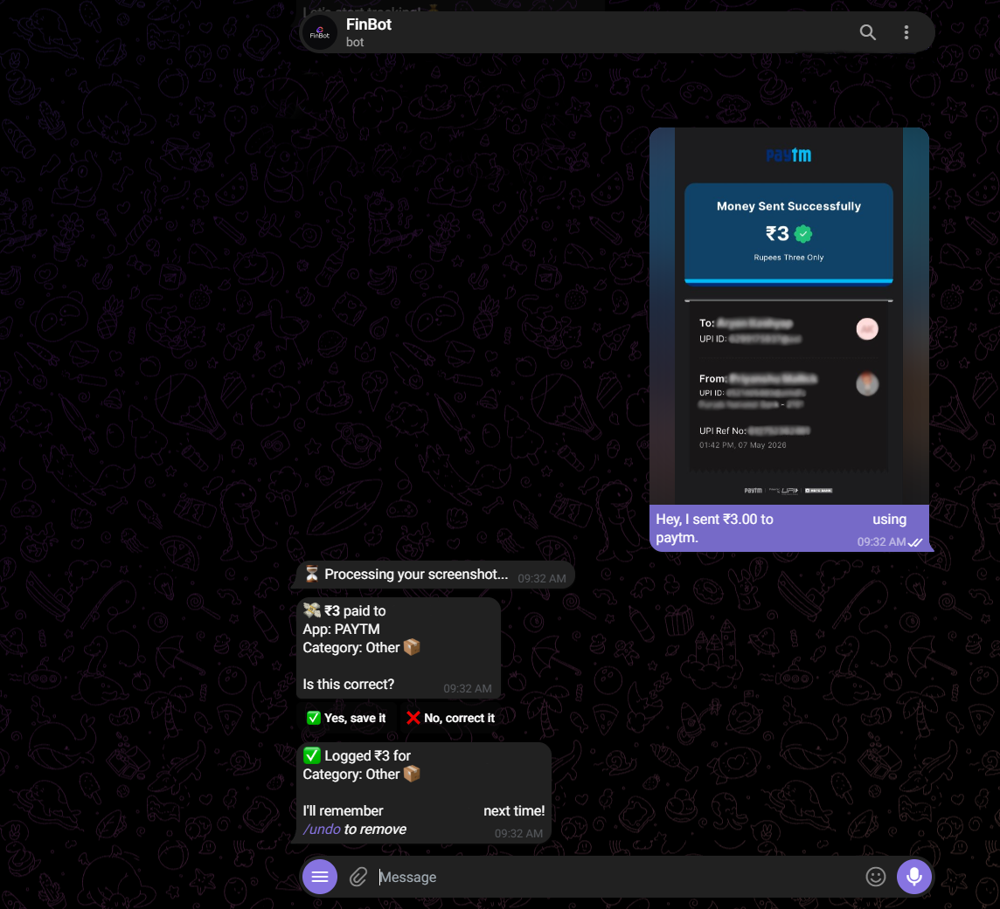
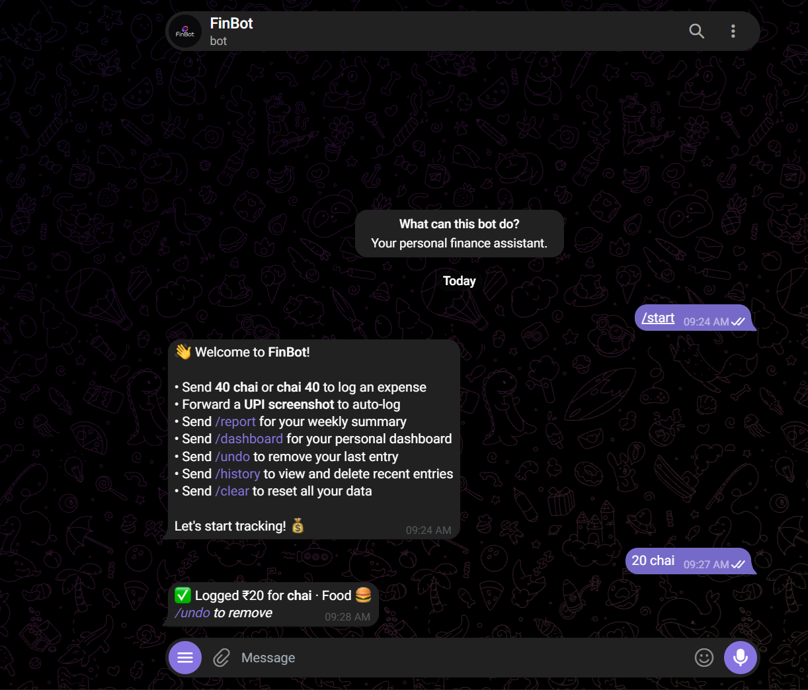
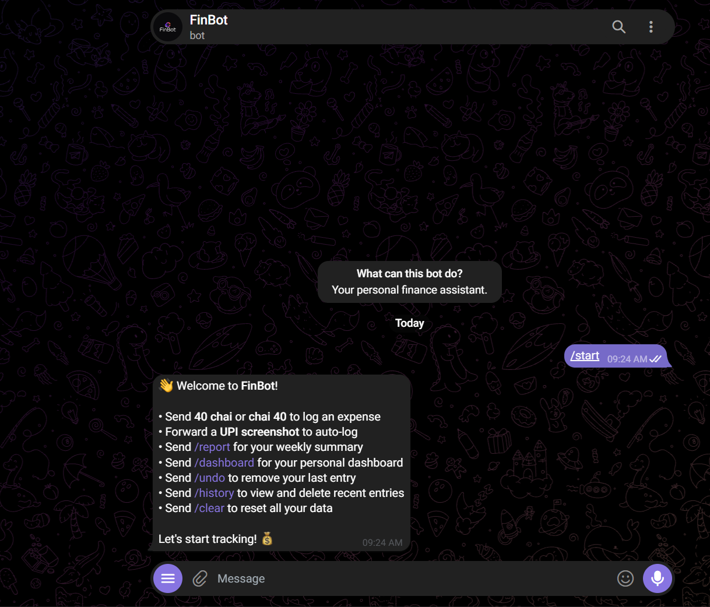
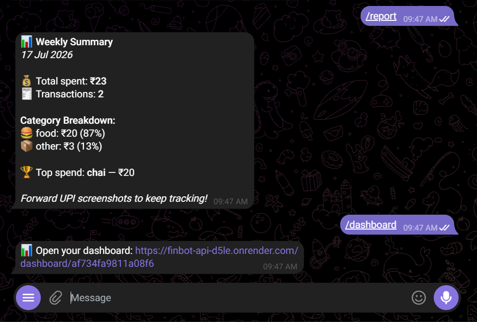
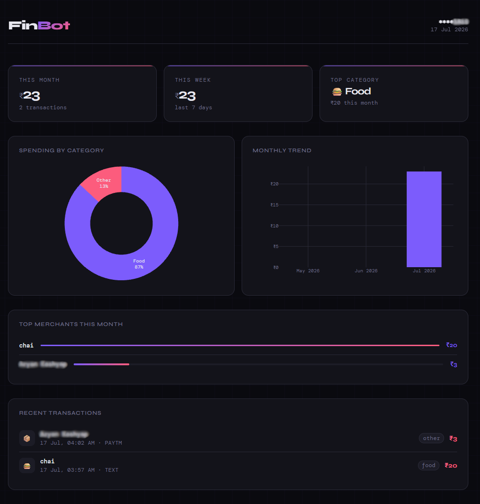

<div align="center">

# 💰 FinBot

### Personal Finance Intelligence via Telegram & WhatsApp

Track UPI payments, log cash expenses, and visualise your spending — all without leaving your chat app.

[](https://t.me/HeyFinBot)
[](https://github.com/PriyanshuM04/FINBOT)
[](https://finbot-api-d5le.onrender.com)

</div>

---

## What is FinBot?

FinBot is a personal finance tracker that lives entirely inside Telegram and WhatsApp. No new app to install, no new habit to build. Forward a UPI screenshot and it auto-logs the transaction. Type `20 chai` and it's logged instantly.

Built specifically for the Indian UPI ecosystem — GPay, PhonePe, Paytm, and Amazon Pay.

---

## Features

- **UPI Screenshot Parsing** — Forward any GPay, PhonePe, Paytm, or Amazon Pay screenshot and FinBot reads the amount, merchant, and app automatically
- **Smart Merchant Memory** — Redis TTL caching with frequency-based promotion. Bot asks category once, remembers forever for frequent merchants
- **Text Expense Logging** — Type `20 chai` or `chai 20` — both work. Bot auto-detects category from keywords
- **Category Learning** — When a keyword doesn't match, bot shows a category picker. Next time the same keyword appears, it's auto-categorised
- **Inline Keyboards** — Tap yes/no and category buttons instead of typing — full native Telegram button support
- **Weekly Summary** — Spending breakdown by category, top merchant, total transactions
- **Web Dashboard** — Interactive Plotly charts with category breakdown, monthly trend, top merchants, recent transactions
- **Undo & History** — Remove the last logged entry with `/undo` or view and delete specific entries via `/history`

---

## How to Use

### Getting Started on Telegram

1. Open Telegram and search **@HeyFinBot**
2. Tap **Start** or send `/start`
3. That's it — no signup, no join code, no session expiry

### Getting Started on WhatsApp

1. Save **+1 415 523 8886** on WhatsApp
2. Send: `join parent-receive`
3. Wait for the confirmation message
4. Send `hello` to get started

> ⏱️ First message may take ~50 seconds if the bot has been idle — it wakes up automatically on Render's free tier.

---

### Logging Expenses

**Forward a UPI screenshot:**

Forward any payment confirmation screenshot → bot reads amount and merchant → shows category suggestion with Yes/No buttons → tap Yes to save, No to pick a different category.



---

**Type a quick expense:**

```
20 chai          → asks category if unknown, auto-logs if known
chai 20          → same, both formats work
599 recharge     → auto-categorised as Bills
```


---

### Commands

| Command | What it does |
|---|---|
| `/start` | Welcome message and instructions |
| `/report` | Weekly spending summary with category breakdown |
| `/dashboard` | Link to your personal interactive dashboard |
| `/undo` | Remove the last logged transaction |
| `/history` | View last 5 transactions with delete buttons |
| `/clear` | Delete all your transactions and reset data |

<br>


---

### Dashboard

Type `/dashboard` to get your personal link. Opens in browser with:

- Category-wise spending pie chart
- Monthly trend bar chart (last 3 months)
- Top 5 merchants this month
- Last 5 transactions



---

## Tech Stack

| Layer | Technology |
|---|---|
| **Backend** | FastAPI, Python 3.12 |
| **Messaging** | python-telegram-bot 20.7, Twilio WhatsApp API |
| **OCR** | OCR.space API |
| **Image Processing** | OpenCV |
| **Caching** | Redis (TTL-based merchant memory) |
| **Database** | MySQL, SQLAlchemy |
| **Task Processing** | FastAPI BackgroundTasks |
| **Dashboard** | Plotly, HTML, CSS, JavaScript |
| **Deployment** | Docker, Render |

---

## Architecture

Incoming messages hit a FastAPI webhook — text commands are handled synchronously while UPI screenshots are offloaded to a background task. The background task downloads the image, sends it to OCR.space for text extraction, routes the result through app-specific parsers (GPay, PhonePe, Paytm, Amazon Pay), normalises into a standard transaction object, checks Redis for known merchants, and sends the result back via Telegram or WhatsApp. Transactions are persisted in MySQL on Aiven. The web dashboard reads directly from MySQL and renders with Plotly.

---

## Project Structure

```
FINBOT/
├── app/
│   ├── bot/
│   │   ├── telegram_handler.py      # Telegram webhook router
│   │   ├── telegram_commands.py     # Command logic + category learning
│   │   ├── telegram_keyboards.py    # Inline keyboard layouts
│   │   ├── handler.py               # WhatsApp message router
│   │   └── commands.py              # WhatsApp command logic
│   ├── ocr/
│   │   ├── extractor_ocrspace.py    # OCR.space API integration
│   │   └── preprocessor.py          # Image preprocessing
│   ├── parsers/upi/
│   │   ├── gpay.py                  # GPay parser
│   │   ├── phonepe.py               # PhonePe parser
│   │   ├── paytm.py                 # Paytm parser
│   │   ├── amazonpay.py             # Amazon Pay parser
│   │   └── router.py                # Routes to correct parser
│   ├── cache/
│   │   ├── merchant_cache.py        # TTL-based Redis caching
│   │   └── promoter.py              # Frequency-based DB promotion
│   ├── dashboard/
│   │   └── routes.py                # Dashboard API endpoints
│   ├── intelligence/
│   │   └── report_builder.py        # Weekly/monthly summary logic
│   ├── db/
│   │   ├── models.py                # SQLAlchemy models
│   │   └── database.py              # DB connection
│   └── main.py                      # FastAPI app, webhook endpoints
├── frontend/
│   ├── index.html
│   ├── css/style.css
│   └── js/
│       ├── dashboard.js
│       └── charts.js
├── Dockerfile.web                   # Lightweight web service image
├── Dockerfile.worker                # Full image with OCR dependencies
└── requirements-web.txt             # Web service dependencies
```

---

<div align="center">

Built by [Priyanshu Mallick](https://github.com/PriyanshuM04)

</div>